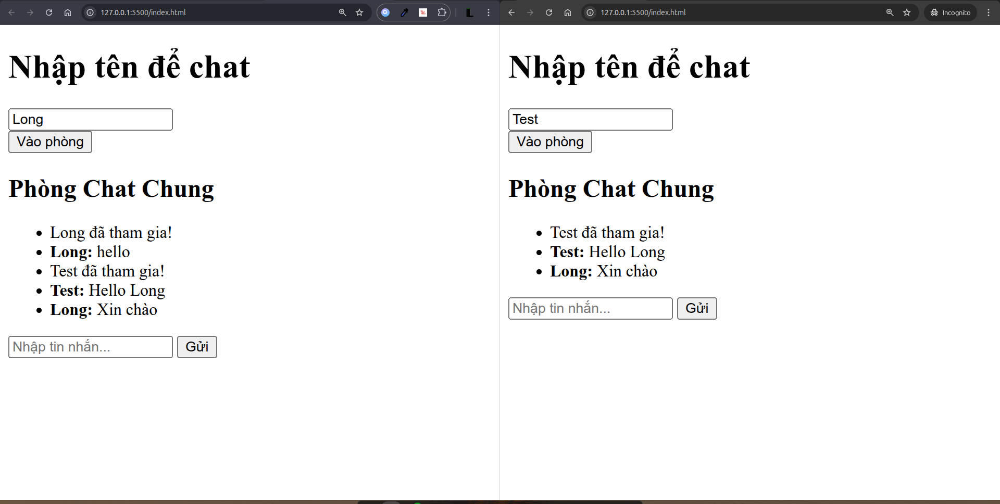

## Spring WebSocket Chat Basic

### Demo




### TechStack

- Backend: Spring Boot WebSocket + STOMP 
- Frontend: HTML/JS +  SockJS + Stomp.js

### Endpoints

- Endpoint kết nối: `/ws`
- App destination: `/app/**`
- Broker topic: `/topic/**`

### Luồng chat

1. Client kết nối tới `/ws`.
2. Gửi JOIN: `/app/chat/join`.
3. Gửi tin nhắn: `/app/chat/send`.
4. Nhận broadcast tại: `/topic/public`.

### ChatMessage

```json
{
	"sender": "longpham",
	"type": "JOIN | TEXT | LEAVE",
	"content": "Hello ace"
}
```


